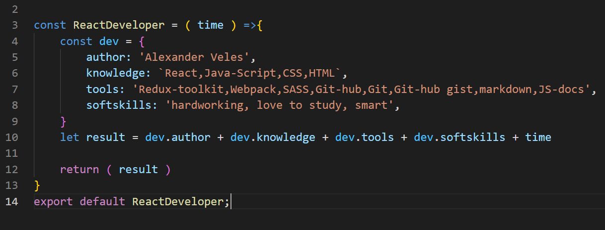

## Hi , i am Webioann , junior React developer from Ukraine.

_842_25_72-%8B66A9.svg?style=flat&logo=viber&logoColor=green)

### I use in my progects:
* React with Redux, JavaScript,SCSS
* librarys :  Redux, React-Router
* React-hooks
* SASS , Bootstrap , own CSS-framework "Total"
### Soft skills:
* hardworking
* plodding
* meticulous
* love studying

<!-- 
 -->

<!-- 

 -->

<!-- 

 -->

